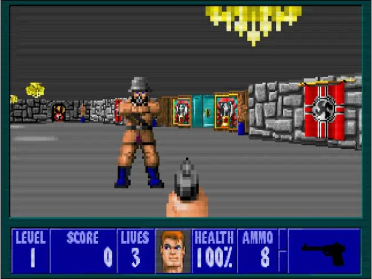
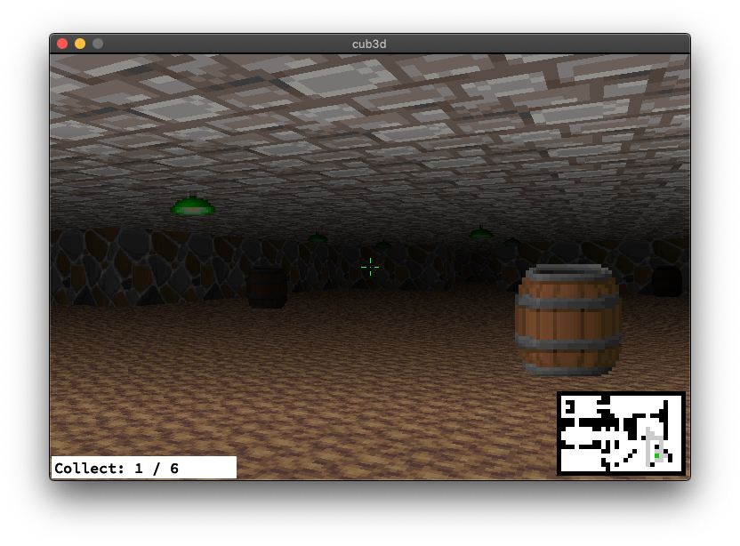

# cub3d

# Project Overview
Wolfenstein-Style 3D Game (C, MiniLibX): Implemented raycasting techniques to create a pseudo-3D game engine, dynamically rendering environments based on file input.
# Wolfenstein 3D
Wolfenstein 3D is the ancestor of games like Doom (Id Software, 1993), Doom II (Id Software, 1994), Duke Nukem 3D (3D Realm, 1996) and Quake (Id Software, 1996), that are additional eternal milestones in the world of video games.
Wolfenstein: (https://fr.wikipedia.org/wiki/Wolfenstein_3D)).



### Prerequisites
- C launguage.
- miniLibX graphics library.

### Scene Description File
Create a scene description file (e.g., example.cub) with the following elements:
Textures for North, South, East, and West walls. Floor and ceiling colors. Map layout (0 for empty space, 1 for a wall, N/S/E/W for player start position). Example:

  ```bash
  NO ./path_to_the_north_texture
  SO ./path_to_the_south_texture
  WE ./path_to_the_west_texture
  EA ./path_to_the_east_texture
  F 220,100,0
  C 225,30,0
  1111111111111111111111111
  1000000000110000000000001
  1011000001110000000000001
  1001000000000000000000001
  111111111011000001110000000000001
  100000000011000001110111111111111
  11110111111111011100000010001
  ...
```

### A screenshot of the game



