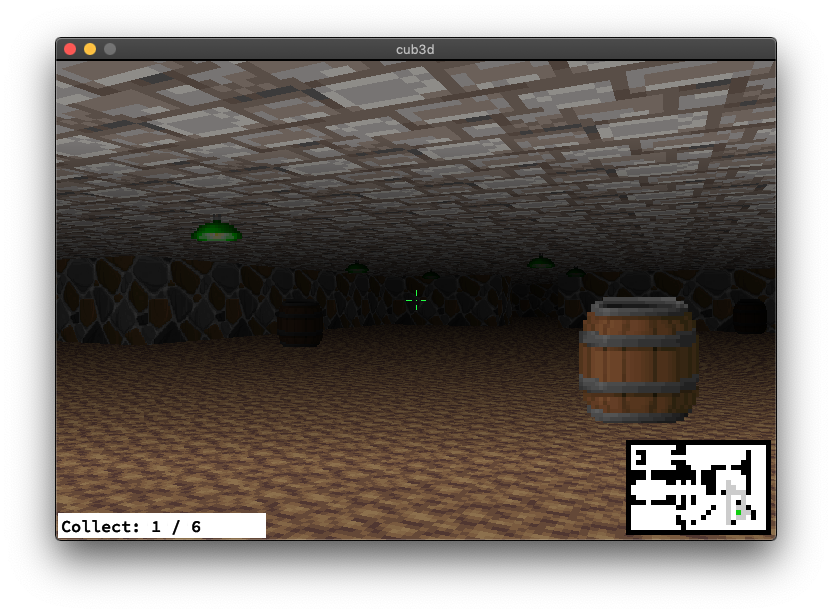

# cub3d

Wolfenstein-Style 3D Game (C, MiniLibX): Implemented raycasting techniques to create a pseudo-3D game engine, dynamically rendering environments based on file input.

Wolfenstein: (https://fr.wikipedia.org/wiki/Wolfenstein_3D)).

Game

